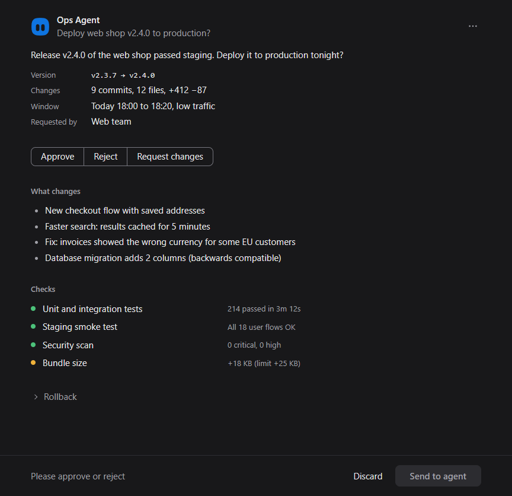
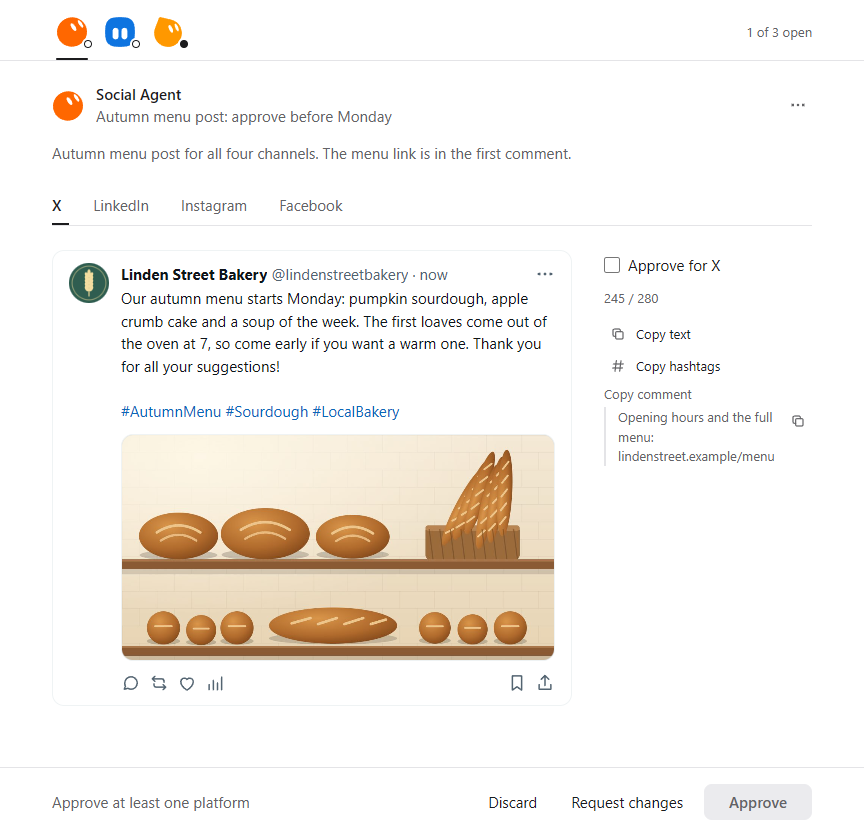
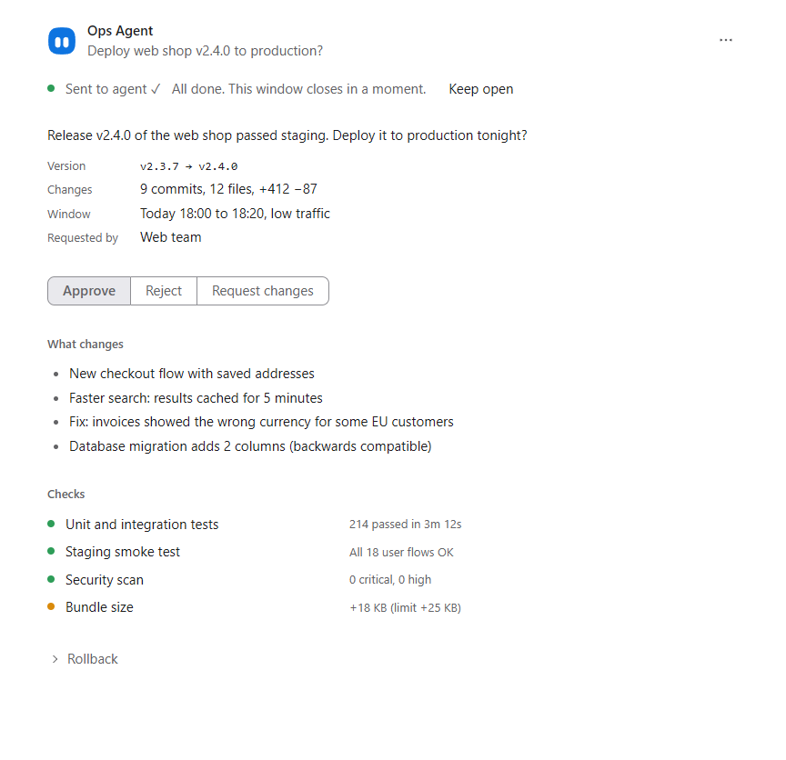

[](https://github.com/realspqrk/grokbot-desk/actions/workflows/ci.yml)
[](LICENSE)
[](https://www.python.org/downloads/)
[](#platforms)
[](CHANGELOG.md)

> [!WARNING]
> ⚠️ This is not an official Grok Bot plugin. SpaceXAI, please don't sue me.

# grokbot-desk

Status: 1.0.0-beta.1. Windows is supported; macOS is a beta.

The CEO/CTO decision dashboard for your bots.

You manage your bots like employees. Make decisions like a CEO.

Optimized for Grok Bot. Works with any agent that can run a command.

Chat is awful for discussing serious work. When a bot needs your decision, a human-friendly window pops up instead. grokbot-desk gives AI agents, including a Grok Bot, a local desktop UI: send JSON, review it, and read the decision as JSON.

Bots bring you decisions and reports when they need you. The server stays on this machine.

## What you see

One open report is a compact pop-up.



Several open reports use a slim avatar strip along the top. After each decision, the next report comes forward.



When you send the decision, that report is done.



The window is German by default. `RS_LANG=en` selects the English string table. Result times use Europe/Vienna.

## Use with Grok Bot

On Windows, first complete [Quick start](#quick-start): verify Python 3.11 or newer and have Microsoft Edge or Google Chrome available. Your bot must be able to run commands on this computer, in the clone folder.

1. Clone grokbot-desk on your own computer (the one whose screen you look at), not on a server or VM:
   `git clone https://github.com/realspqrk/grokbot-desk.git`
2. Add the skill: give your bot `skills/grokbot-desk/SKILL.md` from the clone (add it as a skill, or paste it into the bot's instructions) and tell it where the clone is.
3. Ask your bot: "When you need a decision from me, use grokbot-desk." The next time it needs your yes, a window pops up instead of a chat message.

### Do I need a skill?

No. Any bot that can run commands on your computer can use grokbot-desk from this README. The skill makes it reliable: it tells the bot when a pop-up beats chat, which built-in template to pick, how to wait for your answer, and what never belongs in a payload.

## How it works

1. The agent writes a JSON payload for a template.
2. `show` checks the payload and, on Windows, opens one Edge or Chrome app window on this machine.
3. You decide there. The window keeps one primary action on screen and tucks notes and extra detail away.
4. `wait` blocks until a result file exists, then prints the status and its path. `result` prints the decision JSON.

The window records the decision. The bot reads the result file and does the work.

## Quick start

On Windows, use Python 3.11 or newer and Microsoft Edge or Google Chrome. The runtime uses only Python's standard library. Template checks need additional development tools; see Templates below.

```bash
git clone https://github.com/realspqrk/grokbot-desk.git
cd grokbot-desk
python report_shell.py --help
```

On Windows, `report-shell.cmd` requires a working `py -3` launcher. Verify `py -3 --version` first. If it cannot find Python but `python --version` works, run `python report_shell.py <command>` from the clone folder instead.

If `status` shows `window_alive: false` right after `show`, your agent runtime may end child processes when a command finishes. Start `python report_shell.py serve` in a terminal that stays open, then run `show` again.

The shipped skill is `skills/grokbot-desk/SKILL.md`.

## Example

This example uses the built-in `decide-list` template. Save it as `make_payload.py`. It writes `payload.json` with a fresh timestamp.

```python
import json
from datetime import datetime, timezone
from pathlib import Path

payload = {
    "schema": "report-shell/payload@1",
    "template": "decide-list",
    "version": 1,
    "bot": "inbox-agent",
    "identity": {
        "name": "Inbox Agent",
        "avatar_shape": "squircle",
        "avatar_color": "blue",
    },
    "title": "Two requests need a decision",
    "created": datetime.now(timezone.utc).isoformat(timespec="seconds"),
    "data": {
        "intro": "Approve these two requests? Approve = go ahead, Reject = I say no, Defer = ask me again next week.",
        "items": [
            {
                "id": "travel",
                "title": "Workshop travel",
                "source": "Events team",
            },
            {
                "id": "laptop",
                "title": "Replace a developer laptop",
            },
        ],
    },
}
Path("payload.json").write_text(json.dumps(payload), encoding="utf-8")
```

Create the payload and open the window:

```bash
python make_payload.py
python report_shell.py show decide-list --data payload.json
```

The command returns at once with one JSON line: `run_id`, `url` (on `127.0.0.1`, port from `config.json`, otherwise `18742`), and `result_path`. Optional flags are `--focus` and `--no-window`.

After you choose and send, read the outcome:

```bash
python report_shell.py wait RUN_ID --timeout 120
python report_shell.py result RUN_ID
```

Replace `RUN_ID` with the id printed by `show`. `wait` prints `{"status":"submitted","result_path":"..."}` when you submit. Other terminal statuses are `cancelled` and `expired`. `--timeout` is in seconds. `0` waits without a limit. `result` prints the full envelope. This illustration uses example ids and timestamps:

The default timeout is 0. In a bot runtime, use a timeout below its shell-call limit; exit 5 means the report is still waiting, so call `wait` again later.

```json
{
  "schema": "report-shell/result@1",
  "run_id": "RUN_ID",
  "template": "decide-list",
  "template_version": 1,
  "bot": "inbox-agent",
  "status": "submitted",
  "created": "2026-10-08T10:39:00+02:00",
  "decided": "2026-10-08T10:44:12+02:00",
  "duration_s": 312,
  "log": "<data-dir>/log/2026-10-08.jsonl",
  "data": {
    "items": [
      {"id": "travel", "choice": "approve", "note": ""},
      {"id": "laptop", "choice": "defer", "note": ""}
    ],
    "note": ""
  }
}
```

`created` and `decided` use Europe/Vienna time. `duration_s` is the time since the payload was created. `log` points at the local action log.

The result may also contain `identity` diagnostics. With this example's blue avatar colour, it includes `"identity": {"name": "Inbox Agent", "accent_fallback": ["dark"], "warnings": []}`. This records a theme accent fallback and does not change the decision.

## Templates

Five built-in templates:

| id | What it is for |
| --- | --- |
| `review-doc` | Read a draft or report and approve it, or request changes with comments. |
| `pick-option` | Compare 2 to 4 options side by side and pick one. A note is optional. |
| `decide-list` | Approve, reject, or defer up to 5 items, one at a time. |
| `approve-one` | One yes/no decision, with an optional request for changes. |
| `preview-post` | Preview one social post (X, LinkedIn, Instagram, Facebook) and approve it per platform, or request changes. |

Run `python report_shell.py templates` to list what is installed. If none of these fits, `python report_shell.py new example/my-template` writes a template into your data directory, and `python report_shell.py check my-template` checks it. See the [template guide](docs/GUIDE.md).

`show`, `wait`, `result`, `templates`, and `new` need only Python at runtime. `check` is a development check: it also needs Node.js, an existing playwright-core installation (set `RS_PLAYWRIGHT_CORE` to its entry point), and a supported browser. The check uses `py -3` unless `RS_PYTHON` names a working Python executable; for example, in PowerShell: `$env:RS_PYTHON = (Get-Command python).Source`.

## Bot identity

Each bot has a name, a shape avatar, and a colour. Set `identity` on the payload, or the same fields in `bots.json`: `name`, `avatar_shape` (`blob`, `squircle`, `pebble`, `hex`, `teardrop`, `tablet`), `avatar_color` (`blue`, `orange`, `yellow`, `magenta`, `red`, `violet`, `black`, `green`, `gray`), optional `avatar` (PNG, JPEG, WebP, or GIF), and optional `accent` (`#RRGGBB`).

```json
{"name": "Inbox Agent", "avatar_shape": "squircle", "avatar_color": "blue"}
```

Payload `identity` wins over `bots.json`, then the shipped registry, then the defaults. `name` and `accent` are picked per field; the avatar fields come as one set from the first source that states any of them, in the order image, shape and colour, initials. An unknown shape shows initials, an unknown colour uses the default colour, and a bad value is skipped for the next source without rejecting the report.

Optional `avatar`: PNG, JPEG, WebP or GIF only, at most 256 KB. For payload avatars, use a path relative to the template folder (or `%RS_TEMPLATE%/...`); registry paths are relative to the registry folder. Absolute avatar paths are allowed only inside the data directory. `media_roots` applies to report media, not to avatar paths. Optional `accent` is `#RRGGBB`. Never use SVG.

## Platforms

Windows is supported. Edge or Chrome opens an app window. macOS is experimental. The data folder is implemented there. Browser launch, clipboard, and platform tests are not finished. The macOS CI job is advisory.

On experimental macOS, verify `python3 --version` is 3.11 or newer and replace every `python` command with `python3`. Use forward-slash paths and shell `export` syntax for environment variables. The default data directory is `~/Library/Application Support/grokbot-desk`; `RS_DATA_DIR` overrides it.

The macOS launcher searches Edge, then Chrome, in `~/Applications` and `/Applications`. Without either it opens the system default browser, which may show a normal tab instead of an app window. Automatic focus and attention are not implemented on macOS. Browser launch and clipboard support remain experimental. macOS security or Gatekeeper prompts may require you to open and approve a trusted Python/browser installation manually; a successful CLI return does not prove that an asynchronous browser launch reached a visible window.

## Privacy and security

The server listens only on `127.0.0.1`. The page loads no remote images, fonts, or sites. Payloads, results, and action logs stay on this machine. On Windows the default folder is `%LOCALAPPDATA%\grokbot-desk`. `RS_DATA_DIR` overrides it. An existing legacy data folder is reused when the new folder is absent. The optional webhook is off unless you enable it, set a key, and allow-list an HTTPS URL. At server startup, files in `runs`, `results`, and `log` older than 30 days are removed. Media and browser profiles are kept.

## Contributing

See [CONTRIBUTING.md](CONTRIBUTING.md).

## License

[MIT](LICENSE).

If you like this project, support me by checking out [PhraseVault](https://phrasevault.app) or [BackupOnShutdown](https://backuponshutdown.app).

## Closing note

Dear Grok Bot team: please steal this repo and build it in natively. The MIT license makes that easy.
